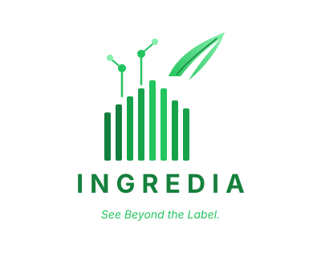
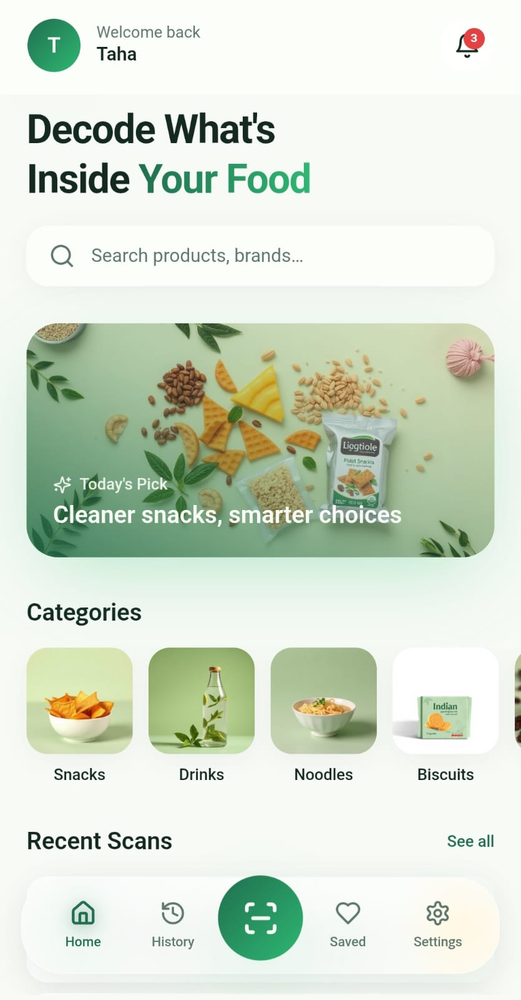
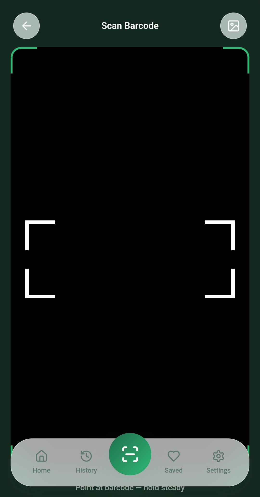
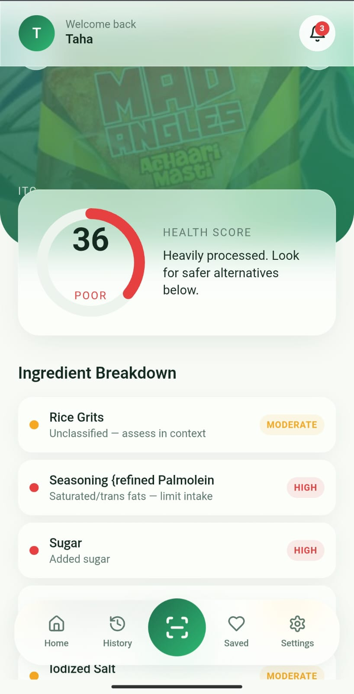
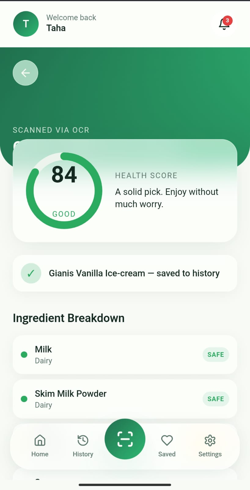
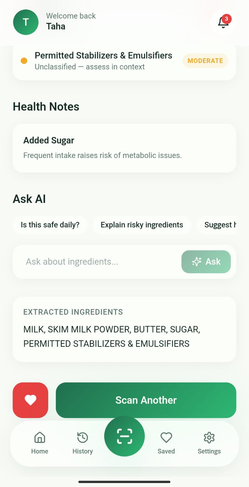
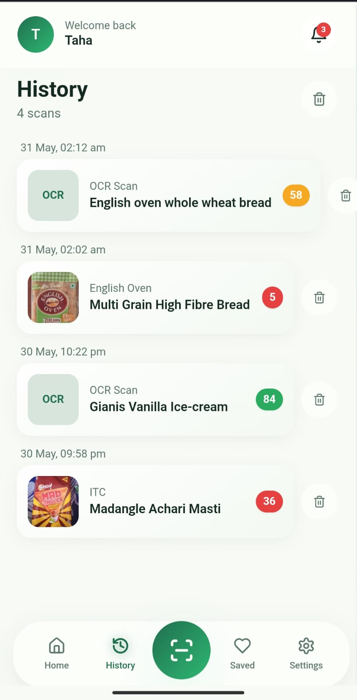

<p align="center">
  
</p>

<h1 align="center">Ingredia</h1>

<p align="center">
  <strong>See Beyond the Label.</strong>
</p>

<p align="center">
  
  
  
  
  
  
  
  
</p>

<p align="center">
  <a href="https://ingredia-taupe.vercel.app"><strong>Live Demo</strong></a>
</p>

A mobile-first AI-powered nutrition analysis platform that helps Indian consumers understand what's inside packaged food products through barcode scanning, OCR-based ingredient extraction, and intelligent health scoring.

---

## The Problem

India's packaged food market is growing rapidly, but most consumers struggle to understand ingredient labels. Complex chemical names, E-numbers, and fine print make it nearly impossible to quickly assess whether a product is healthy. Existing nutrition apps focus on calorie counting — none of them explain *why* an ingredient matters or what it does to your body.

## The Solution

Ingredia bridges this gap. Point your phone camera at any packaged food barcode, and within seconds you get a clear breakdown of every ingredient — color-coded by risk level, scored for overall health impact, and explained in plain language by AI. For products not in global databases (common with Indian brands), simply photograph the ingredient label and our OCR pipeline extracts and analyzes the text automatically.

---

## Features

| Feature | Description |
|---------|-------------|
| **Barcode Scanner** | Real-time camera-based scanning supporting EAN-13, EAN-8, UPC-A, and UPC-E formats |
| **OCR Ingredient Extraction** | Photograph ingredient labels — Tesseract + Gemini Vision extract text from even low-quality Indian product labels |
| **Health Scoring Engine** | Deterministic 0–100 scoring based on ingredient classification (not random, not AI-generated) |
| **Risk Classification** | Every ingredient tagged as Safe (green), Moderate (yellow), or Risky (red) with explanations |
| **AI-Powered Explanations** | Ask questions like "Why is sodium benzoate risky?" or "Can I consume this daily?" — powered by Gemini |
| **Safer Alternatives** | Curated healthier product recommendations for each category |
| **Google Authentication** | Secure login via Google OAuth through Supabase Auth |
| **Scan History** | Every scan persisted and accessible across sessions |
| **Saved Alternatives** | Bookmark healthier products for later reference |
| **Mobile-First Design** | Optimized for phone usage with HTTPS camera support |
| **Open Food Facts Integration** | Access to a global database of 3M+ products |

---

## Screenshots

<p align="center">
  
  
  
</p>

<p align="center">
  
  
  
</p>

---

## Tech Stack

### Frontend
- **React 18** — Component-based UI
- **TypeScript** — Type-safe development
- **Tailwind CSS** — Utility-first styling
- **Vite** — Fast build tooling with HTTPS dev server
- **html5-qrcode** — Browser-based barcode scanning
- **Supabase JS** — Auth and database client
- **React Router** — Client-side routing
- **Sonner** — Toast notifications

### Backend
- **FastAPI** — High-performance Python API framework
- **Python 3.12** — Runtime
- **Uvicorn** — ASGI server
- **httpx** — Async HTTP client for Open Food Facts
- **Pytesseract** — Tesseract OCR wrapper
- **Pillow** — Image preprocessing (contrast, sharpen, binarize)
- **Google Generative AI** — Gemini API client

### Database & Auth
- **Supabase** — PostgreSQL database with Row Level Security
- **Supabase Auth** — Google OAuth + email/password authentication
- **JWT Verification** — Backend validates Supabase tokens

### External APIs
- **Open Food Facts** — Global packaged food product database
- **Google Gemini 2.5 Flash** — AI-powered ingredient explanations
- **Tesseract OCR** — Local text extraction from images

---

## Architecture

```
┌─────────────────────────────────────────────────────────────────┐
│                        FRONTEND (React)                          │
│  Barcode Scanner → API Client → UI Rendering → Auth State       │
└──────────────────────────────┬──────────────────────────────────┘
                               │ HTTPS
                               ▼
┌─────────────────────────────────────────────────────────────────┐
│                      BACKEND (FastAPI)                           │
│                                                                  │
│  ┌──────────────┐  ┌──────────────┐  ┌──────────────────────┐  │
│  │ Product      │  │ OCR          │  │ AI Service            │  │
│  │ Service      │  │ Pipeline     │  │ (Gemini)              │  │
│  │              │  │              │  │                        │  │
│  │ Open Food    │  │ Preprocess → │  │ Ingredient            │  │
│  │ Facts API    │  │ Tesseract →  │  │ Explanations          │  │
│  │ ↓            │  │ Cleanup →    │  │ Health Guidance        │  │
│  │ Health       │  │ Extract →    │  │ Alternatives           │  │
│  │ Engine       │  │ Parse        │  │                        │  │
│  └──────────────┘  └──────────────┘  └──────────────────────┘  │
└──────────────────────────────┬──────────────────────────────────┘
                               │
                               ▼
┌─────────────────────────────────────────────────────────────────┐
│                      SUPABASE                                    │
│  Auth (Google OAuth) │ PostgreSQL (scans, saved, profiles)       │
│  Row Level Security  │ JWT Token Verification                    │
└─────────────────────────────────────────────────────────────────┘
```

### Barcode Scan Flow

```
User scans barcode
    → html5-qrcode detects EAN/UPC
    → Frontend sends barcode to POST /api/scan/barcode
    → Backend queries Open Food Facts API
    → Health Engine classifies each ingredient (green/yellow/red)
    → Deterministic health score calculated (0-100)
    → Safer alternatives fetched
    → Complete analysis returned to frontend
    → Results page renders with score, breakdown, and AI option
```

### OCR Flow

```
User photographs ingredient label
    → Image uploaded to POST /api/scan/ingredients
    → Pillow preprocesses (grayscale, contrast, sharpen, binarize)
    → Tesseract OCR extracts raw text
    → Cleanup pipeline removes URLs, barcodes, FSSAI numbers, garbage
    → Ingredient section extracted (finds "Ingredients:" header)
    → Parsed into structured array
    → Quality check (confidence + food word validation)
    → If poor quality → Gemini Vision fallback
    → Health Engine scores the extracted ingredients
    → Analysis returned to frontend
```

---

## Project Structure

```
ingredia/
├── src/                          # Frontend source
│   ├── components/               # Reusable UI components
│   │   ├── AppShell.tsx          # Layout with nav + header
│   │   ├── HealthScore.tsx       # Circular score visualization
│   │   ├── ProductCard.tsx       # Product display card
│   │   └── ui/                   # shadcn/ui components
│   ├── pages/                    # Route pages
│   │   ├── Scan.tsx              # Barcode scanner
│   │   ├── Processing.tsx        # Loading/analysis state
│   │   ├── Results.tsx           # Product analysis results
│   │   ├── History.tsx           # Scan history
│   │   ├── Saved.tsx             # Saved alternatives
│   │   ├── Auth.tsx              # Login/signup
│   │   └── SettingsPage.tsx      # User settings
│   ├── lib/
│   │   └── api.ts                # Backend API client
│   ├── hooks/
│   │   └── useAuth.tsx           # Auth context provider
│   ├── integrations/
│   │   └── supabase/             # Supabase client + types
│   ├── App.tsx                   # Router + providers
│   └── main.tsx                  # Entry point
├── backend/                      # FastAPI backend
│   ├── app/
│   │   ├── main.py               # API routes + CORS
│   │   ├── config.py             # Environment configuration
│   │   ├── models.py             # Pydantic schemas
│   │   ├── auth.py               # JWT verification middleware
│   │   ├── health_engine.py      # Deterministic scoring engine
│   │   ├── product_service.py    # Open Food Facts integration
│   │   ├── ocr_service.py        # OCR pipeline (Tesseract + Gemini)
│   │   └── ai_service.py         # Gemini AI service
│   ├── requirements.txt
│   ├── run.py                    # Server entry point
│   └── .env                      # Backend secrets
├── supabase-migration.sql        # Database schema + RLS policies
├── .env                          # Frontend environment
├── vite.config.ts                # Vite + HTTPS config
└── package.json
```

---

## Installation

### Prerequisites

- Node.js 18+
- Python 3.11 or 3.12
- Tesseract OCR ([Windows installer](https://github.com/UB-Mannheim/tesseract/wiki))
- Supabase account (free tier)
- Google Gemini API key ([get one free](https://aistudio.google.com/apikey))

### 1. Clone the repository

```bash
git clone https://github.com/your-username/ingredia.git
cd ingredia
```

### 2. Frontend setup

```bash
npm install
```

### 3. Backend setup

```bash
cd backend
py -3.12 -m venv venv

# Windows
venv\Scripts\activate

# Mac/Linux
source venv/bin/activate

pip install -r requirements.txt
```

### 4. Database setup

Run `supabase-migration.sql` in your Supabase Dashboard → SQL Editor. This creates the `scans`, `saved_alternatives`, and `profiles` tables with Row Level Security policies.

### 5. Configure environment variables

See the [Environment Variables](#environment-variables) section below.

### 6. Run the application

**Terminal 1 — Backend:**
```bash
cd backend
venv\Scripts\activate
python run.py
```
Backend runs at `http://localhost:8000`

**Terminal 2 — Frontend:**
```bash
npm run dev
```
Frontend runs at `https://localhost:8080` (HTTPS enabled for camera access)

**Mobile testing:** Open `https://<your-lan-ip>:8080` on your phone (same WiFi network).

---

## Environment Variables

### Frontend (`.env`)

```env
VITE_API_URL="http://192.168.x.x:8000"
VITE_SUPABASE_URL="https://your-project.supabase.co"
VITE_SUPABASE_PUBLISHABLE_KEY="your-anon-key"
```

### Backend (`backend/.env`)

```env
GEMINI_API_KEY=your_gemini_api_key
SUPABASE_URL=https://your-project.supabase.co
SUPABASE_SERVICE_ROLE_KEY=your_service_role_key
SUPABASE_JWT_SECRET=your_jwt_secret
FRONTEND_URL=http://localhost:8080
OPENFOODFACTS_BASE_URL=https://world.openfoodfacts.org/api/v2/product
TESSERACT_CMD=C:\Program Files\Tesseract-OCR\tesseract.exe
```

---

## API Endpoints

| Method | Endpoint | Auth | Description |
|--------|----------|------|-------------|
| `POST` | `/api/scan/barcode` | No | Look up product by barcode, return full analysis |
| `POST` | `/api/scan/ingredients` | No | OCR extract + analyze ingredient label image |
| `POST` | `/api/analyze` | No | Analyze raw ingredient text string |
| `POST` | `/api/ai/ask` | No | Ask Gemini about ingredients (educational) |
| `GET` | `/api/history` | JWT | Get authenticated user's scan history |
| `GET` | `/api/saved` | JWT | Get authenticated user's saved alternatives |
| `GET` | `/health` | No | Server health check |

### Example Request

```bash
curl -X POST http://localhost:8000/api/scan/barcode \
  -H "Content-Type: application/json" \
  -d '{"barcode": "5449000000996"}'
```

### Example Response

```json
{
  "found": true,
  "product": {
    "barcode": "5449000000996",
    "name": "Coca-Cola",
    "brand": "Coca-Cola",
    "image": "https://images.openfoodfacts.org/...",
    "ingredientsText": "carbonated water, sugar, colour...",
    "analysis": {
      "score": 74,
      "ingredients": [
        {"name": "Carbonated Water", "risk": "green", "note": "Base ingredient"},
        {"name": "Sugar", "risk": "red", "note": "Added sugar"}
      ],
      "notes": [
        {"title": "Added Sugar", "body": "Frequent intake raises risk of metabolic issues."}
      ]
    }
  },
  "alternatives": []
}
```

---

## Health Scoring Logic

The health score is **deterministic** — same ingredients always produce the same score. It is not AI-generated.

```
Base Score: 100

Deductions:
  - Each RED ingredient:    -12 points
  - Each YELLOW ingredient: -4 points
  - Each GREEN ingredient:  +2 points
  - Long ingredient list (>10 items): -2 per extra item

Final Score: clamped to [5, 100]
```

### Risk Classification

| Level | Color | Examples |
|-------|-------|----------|
| Safe | 🟢 Green | Water, whole wheat, spices, oats, ghee |
| Moderate | 🟡 Yellow | Salt, citric acid, caffeine, refined oil, maltodextrin |
| Risky | 🔴 Red | Sugar, MSG, sodium benzoate, artificial colours, HFCS, maida |

---

## AI Safety Disclaimer

Ingredia provides **educational nutritional guidance** based on publicly available food science information. It does not constitute medical advice, diagnosis, or treatment recommendations. The AI-powered explanations are generated by Google Gemini and should be treated as informational content, not professional dietary counsel.

Always consult a qualified nutritionist or healthcare provider for personalized dietary advice, especially if you have allergies, medical conditions, or specific nutritional requirements.

---

## Future Scope

- **Native Mobile App** — React Native or Flutter for iOS/Android with offline barcode scanning
- **Personalized Recommendations** — Dietary preferences, allergen profiles, and health goals
- **Community Reviews** — User-submitted product reviews and ingredient corrections
- **Regional Food Database** — Indian product database to supplement Open Food Facts coverage
- **Fitness Integration** — Connect with health apps for holistic nutrition tracking
- **Multi-language Support** — Hindi, Tamil, Telugu, and other Indian language interfaces
- **Nutrition Label Comparison** — Side-by-side product comparison tool

---

## Contributing

Contributions are welcome. To contribute:

1. Fork the repository
2. Create a feature branch (`git checkout -b feature/your-feature`)
3. Commit your changes (`git commit -m 'Add your feature'`)
4. Push to the branch (`git push origin feature/your-feature`)
5. Open a Pull Request

Please ensure your code follows the existing style conventions and includes appropriate error handling.

---

## License

This project is licensed under the MIT License. See [LICENSE](LICENSE) for details.

---

<p align="center">
  Built with purpose — helping Indian consumers make healthier food choices, one scan at a time.
</p>
